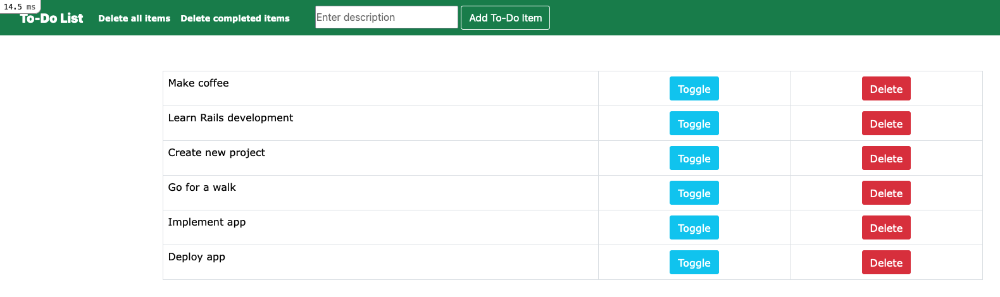
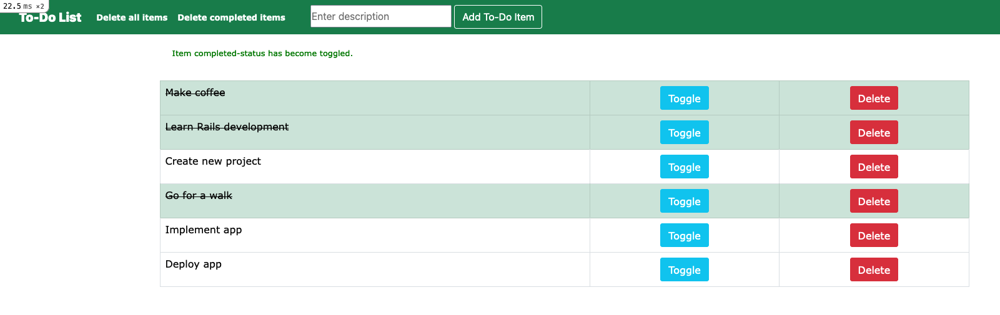

# To-Do List App

Basic CRUD-app, done with Rails 6 and Bootstrap 5.

  

  

## Notes

- Webserver Start: `rails s`

- Show only the routes for the 'home'-controller: `rails routes -c home --expanded`

- Open the Rails-console: `rails c`

- Open the Rails-console. Executed commands doesn't modify the data: `rails console --sandbox`

- Generate a controller 'Articles' with a method 'index': `rails generate controller Articles index`
